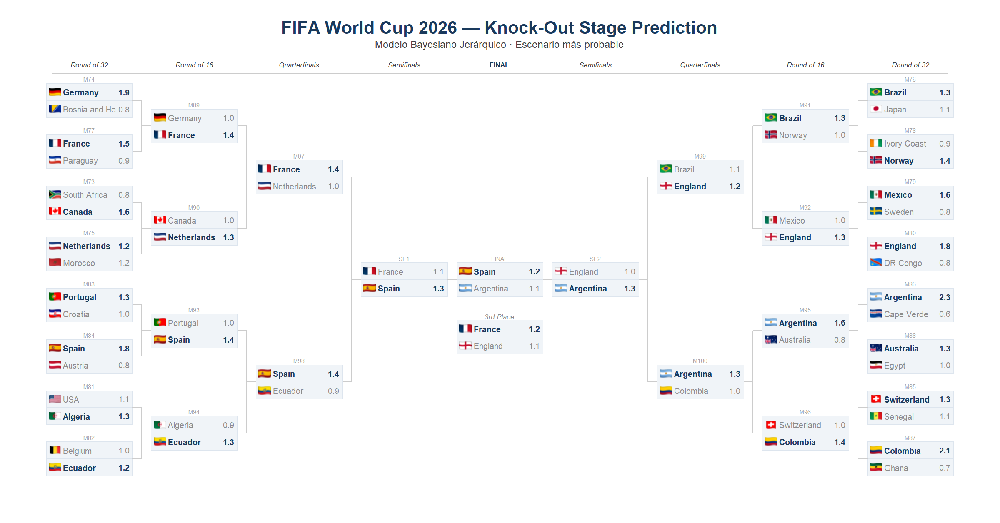
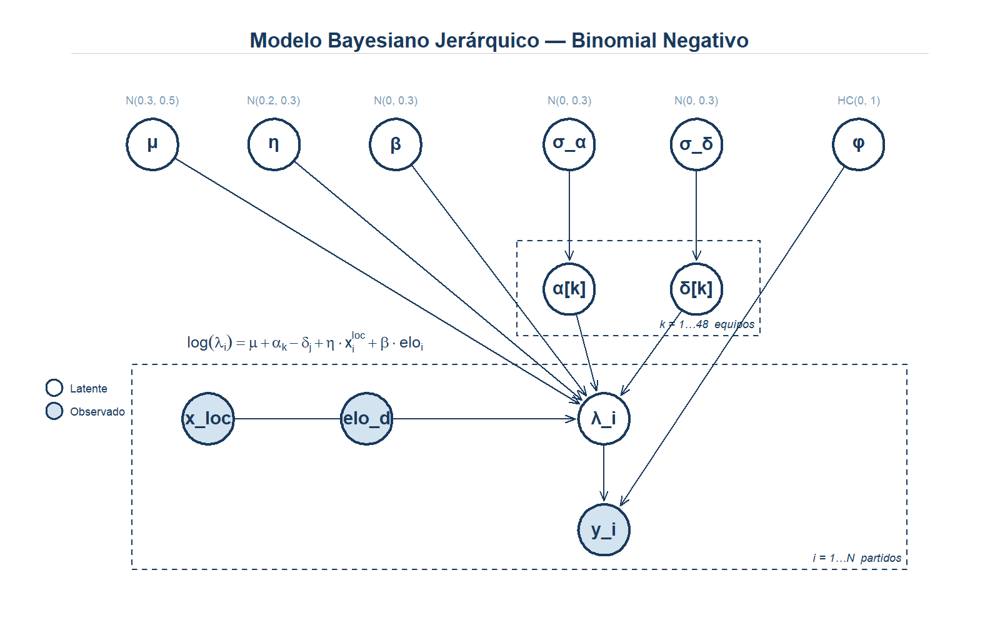

# Predicción FIFA World Cup 2026 — Modelo Bayesiano Jerárquico Dixon-Coles

[](https://www.r-project.org/)
[](https://mc-stan.org/)
[](https://mc-stan.org/rstan/)
[](LICENSE)

Sistema completo de predicción del FIFA World Cup 2026. Combina **47 000+ partidos históricos**, ratings Elo calculados desde cero y un modelo bayesiano jerárquico con corrección Dixon-Coles para predecir marcadores exactos, clasificaciones de grupos y probabilidades por ronda eliminatoria.



---

## Resultados destacados

**Fase de grupos completada — probabilidades de eliminatorias actualizadas con clasificados reales.**

| Equipo | P(Campeón) | P(Final) | P(Semifinal) | P(Cuartos) |
|--------|----------:|--------:|-------------:|----------:|
| Argentina | 13.6% | 23.6% | 23.6% | 38.1% |
| Spain | 13.0% | 20.8% | 20.8% | 31.7% |
| France | 8.6% | 14.7% | 14.7% | 26.3% |
| England | 6.8% | 13.9% | 13.9% | 25.6% |
| Colombia | 6.3% | 12.9% | 12.9% | 24.2% |

> Probabilidades basadas en 10 000 simulaciones Monte Carlo con el modelo Dixon-Coles.  
> Tabla completa en [`output/tables/knockout_probs.csv`](output/tables/knockout_probs.csv).

---

## Datos

### Fuente principal — historial internacional

Se descarga automáticamente el dataset [`martj42/international_results`](https://github.com/martj42/international_results): más de **47 000 partidos internacionales desde 1872** con fecha, equipos, goles, torneo, sede y si el campo es neutral.

Esta misma fuente se usa para el entrenamiento del modelo **y** para actualizar los resultados reales del Mundial en tiempo casi real (el repositorio se actualiza dentro de las horas siguientes a cada partido).

### Filtrado

Del universo de 47 000 partidos se retienen solo los relevantes para el modelo:

| Criterio | Efecto |
|----------|--------|
| Partidos desde 2010 | Cubre 4 Mundiales como historia reciente |
| Al menos un equipo clasificado al WC 2026 | Elimina partidos sin información relevante |
| Modelo final: **ambos** equipos son del WC 2026 | 1 935 partidos de igual nivel de competencia |
| Sin goles faltantes | Solo partidos con resultado completo |

### Ratings Elo

Los ratings Elo **no se toman de ninguna fuente externa** — se calculan desde cero sobre todos los 47 000 partidos ordenados cronológicamente, lo que garantiza que el Elo de cada equipo antes de un partido refleja exactamente su historia hasta ese momento (sin data leakage).

El sistema replica la metodología de eloratings.net:

```
K-factor por tipo de torneo:
  FIFA World Cup (fase final)  → K = 60 × gd_mult
  Copa América / Euro / etc.   → K = 50 × gd_mult
  Eliminatorias                → K = 40 × gd_mult
  Amistosos                    → K = 20 × gd_mult
  Otros competitivos           → K = 35 × gd_mult

Multiplicador por diferencia de goles:
  |GD| ≤ 1 → 1.0 | |GD| = 2 → 1.5 | |GD| ≥ 3 → (11 + |GD|) / 8

Ventaja de local: +100 puntos Elo en campo propio (0 en sede neutral)
```

El rating final de cada equipo se guarda en `data/processed/elo_ratings.csv` y se usa como covariable en el modelo (`elo_diff = (Elo_equipo − Elo_rival) / 400`).

### Ponderación temporal

Los partidos recientes tienen más peso que los históricos. Se aplica decaimiento exponencial con **vida media de 365 días**: un partido de hace un año vale 0.5 vs. uno de hoy.

Adicionalmente, se multiplica por el tipo de torneo: los partidos del Mundial o eliminatorias pesan más que amistosos.

```
peso = exp(−log(2) × días_transcurridos / 365) × multiplicador_torneo
```

---

## Modelo

### Intuición

Queremos saber cuántos goles espera anotar el equipo A contra el equipo B. Esto depende de tres factores:

1. **Fuerza de ataque de A** — ¿cuánto suele anotar A contra rivales promedio?
2. **Solidez defensiva de B** — ¿cuánto suele conceder B?
3. **Diferencia de calidad** — capturada por el Elo

El modelo estima simultáneamente estos tres factores para los 48 equipos usando todos los partidos históricos. Equipos con pocos datos comparten información con el grupo (partial pooling bayesiano), en lugar de ser estimados con alta incertidumbre de forma independiente.

### Especificación

Los goles esperados de cada equipo en un partido siguen un **modelo log-lineal jerárquico**:

```
log(λᵢ) = μ + α[equipo] − δ[rival] + η · es_local + β · elo_diff

α[k] ~ Normal(0, σ_α)    # fuerza de ataque del equipo k
δ[k] ~ Normal(0, σ_δ)    # solidez defensiva del equipo k
```

| Parámetro | Significado | Prior |
|-----------|-------------|-------|
| μ | Goles base (intercepto en log-escala) | Normal(0.3, 0.5) — exp(0.3) ≈ 1.35 goles |
| α[k] | Cuánto más/menos anota el equipo k vs. la media | Normal(0, σ_α) |
| δ[k] | Cuánto más/menos concede el equipo k vs. la media | Normal(0, σ_δ) |
| η | Ventaja de local | Normal(0.2, 0.3) — ≈ +22% goles en casa |
| β | Efecto del Elo | Normal(0, 0.3) |
| σ_α, σ_δ | Dispersión de los efectos entre equipos | Exponential(5) |

### Corrección Dixon-Coles

Un modelo con dos Poisson independientes subestima la frecuencia de empates bajos (0-0, 1-1) y sobreestima los marcadores ajustados (1-0, 0-1). Esto ocurre porque en fútbol los equipos ajustan su táctica según el marcador — la independencia no se sostiene.

La corrección de Dixon & Coles (1997) introduce un parámetro **ρ** que ajusta la probabilidad conjunta de los cuatro marcadores más frecuentes:

```
P(g₁, g₂) = Poisson(g₁; λ₁) × Poisson(g₂; λ₂) × τ(g₁, g₂, λ₁, λ₂, ρ)

τ(0,0) = 1 − λ₁·λ₂·ρ      ← más empates sin goles
τ(1,0) = 1 + λ₂·ρ          ← menos victorias 1-0
τ(0,1) = 1 + λ₁·ρ          ← menos victorias 0-1
τ(1,1) = 1 − ρ              ← más empates 1-1
τ(g₁,g₂) = 1 si g₁+g₂ ≥ 3 ← sin cambio para marcadores altos
```

**ρ se estima del posterior** junto con todos los demás parámetros — no es un valor fijo.

```
ρ ~ Normal(0, 0.1)         # prior: cerca de cero, típicamente negativo en fútbol
```

El valor estimado en este modelo: **ρ ≈ −0.071** (IC 95%: [−0.21, +0.07]), consistente con la literatura empírica internacional.

### Inferencia MCMC

El modelo se ajusta en **Stan** directamente (sin brms) para tener control total sobre la verosimilitud conjunta Dixon-Coles:

```
4 cadenas × 3 000 iteraciones (1 000 warmup) = 8 000 draws efectivos
adapt_delta = 0.99 | max_treedepth = 12
R-hat máximo: 1.002 | n_eff mínimo: 4 000
Divergencias: 2 / 8 000 (0.025%)
```



---

## Pipeline

```
01_scraping.R         Descarga historial (martj42), equipos y fixtures (ESPN)
02_processing.R       Calcula Elo, aplica pesos, construye dataset en formato largo
03_model.R            Ajusta modelos A y B con brms (NegBin — referencia)
03b_model_dc.R        Ajusta modelo Dixon-Coles en Stan  ← modelo activo
04_simulation.R       Simula 100 000 escenarios de fase de grupos
05_knockout.R         Simula 10 000 escenarios de eliminatorias (setup inicial)
06_live_update.R      Auto-descarga resultados reales y re-simula fase de grupos
06b_knockout_live.R   Live update para fase eliminatoria  ← usar desde R32 en adelante
07_bracket_viz.R      Genera bracket visual PNG (R base, 2 400 × 1 256 px)
08_dag.R              Genera DAG del modelo (R base, 1 600 × 1 000 px)
```

### Primera ejecución

```r
source("R/01_scraping.R")     # descarga datos (~2 min)
source("R/02_processing.R")   # procesa y calcula Elo
source("R/03b_model_dc.R")    # ajusta modelo Dixon-Coles (~20-40 min)
source("R/04_simulation.R")   # simula fase de grupos (~5 min)
source("R/05_knockout.R")     # simula eliminatorias (~5 min)
source("R/07_bracket_viz.R")  # genera bracket PNG
source("R/08_dag.R")          # genera DAG
```

### Actualización durante la fase de grupos

```r
# Descarga resultados reales y re-simula partidos pendientes
source("R/06_live_update.R")
```

### Actualización durante la fase eliminatoria

```r
# Usa clasificados reales, lee resultados de martj42, simula lo que resta
source("R/06b_knockout_live.R")   # actualiza bracket_ml.rds, knockout_probs.csv y bracket PNG
```

---

## Estructura del repositorio

```
├── R/
│   ├── 01_scraping.R          scraping de datos
│   ├── 02_processing.R        limpieza, Elo, pesos, formato largo
│   ├── 03_model.R             modelo brms NegBin (referencia)
│   ├── 03b_model_dc.R         modelo Stan Dixon-Coles  ← activo
│   ├── 04_simulation.R        simulación fase de grupos
│   ├── 05_knockout.R          simulación eliminatorias (setup inicial)
│   ├── 06_live_update.R       live update fase de grupos
│   ├── 06b_knockout_live.R    live update fase eliminatoria
│   ├── 07_bracket_viz.R       visualización bracket
│   └── 08_dag.R               DAG del modelo
├── stan/
│   └── model_dc.stan          modelo Stan con verosimilitud Dixon-Coles
├── data/
│   ├── raw/                   historial completo de partidos
│   ├── processed/             Elo, fixtures, equipos, dataset del modelo
│   └── live/                  resultados reales (auto-sincronizados)
├── output/
│   ├── figures/               bracket PNG, DAG, heatmaps, distribuciones
│   ├── tables/                probabilidades por ronda (CSV)
│   └── posteriors/            draws MCMC (.rds, no versionados en git)
```

---

## Paquetes principales

```r
rstan          # interfaz R–Stan para MCMC
brms           # modelo de referencia NegBin
dplyr, readr   # manipulación de datos
rvest, httr2   # scraping ESPN
lubridate      # manejo de fechas
```

---

## Referencias

- Dixon, M. & Coles, S. (1997). *Modelling Association Football Scores and Inefficiencies in the Football Betting Market.* Journal of the Royal Statistical Society, Series C, 46(2), 265–280.
- Gelman, A. et al. (2013). *Bayesian Data Analysis*, 3rd ed. Chapman & Hall/CRC.
- Bürkner, P.C. (2017). *brms: An R Package for Bayesian Multilevel Models Using Stan.* Journal of Statistical Software, 80(1).
- Stan Development Team (2024). *Stan Modeling Language Users Guide and Reference Manual.*

---

*Predicciones generadas con datos hasta junio 2026. Los modelos estadísticos capturan patrones históricos pero no pueden anticipar lesiones, condiciones del día ni factores tácticos no observados — la incertidumbre es parte del resultado.*
